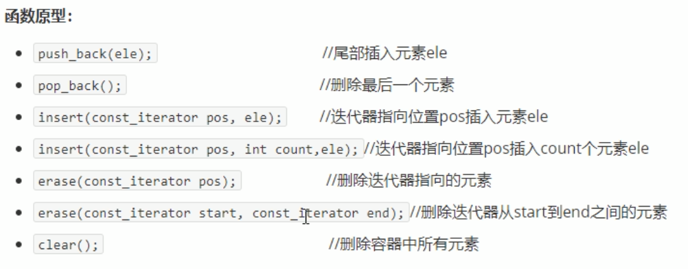
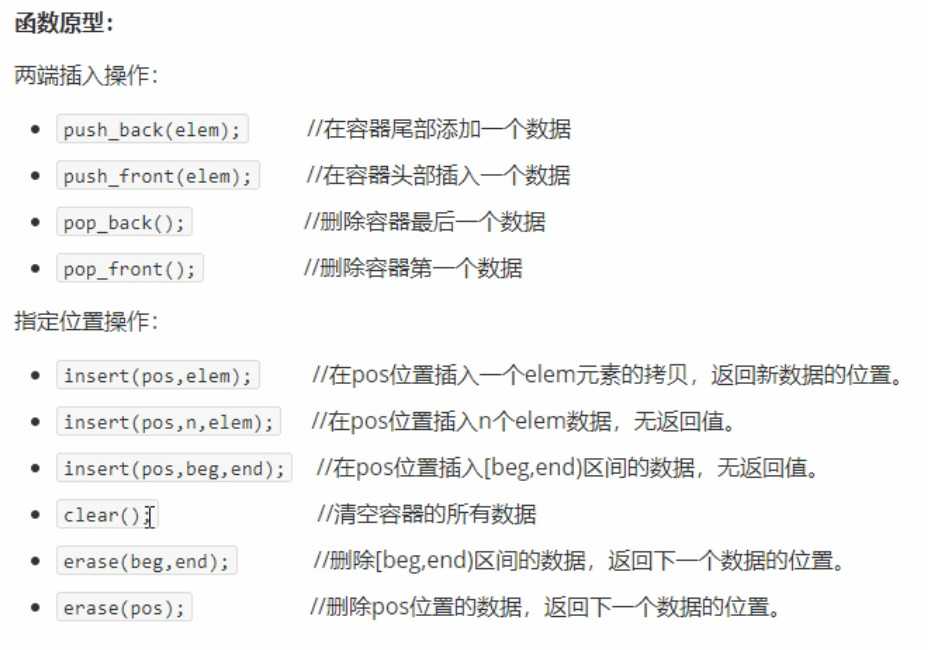

- [vector](#vector)
  - [1.for\_each\_vector](#1for_each_vector)
    - [1.1\_vector\_int.cpp](#11_vector_intcpp)
    - [1.2\_vector\_person.cpp](#12_vector_personcpp)
    - [1.3\_vector\_vector.cpp](#13_vector_vectorcpp)
  - [2.vector\_construct.cpp](#2vector_constructcpp)
  - [3.vector\_assign.cpp](#3vector_assigncpp)
  - [4.vector\_capacity\_and\_size.cpp](#4vector_capacity_and_sizecpp)
  - [5.vector\_inset\_erase.cpp](#5vector_inset_erasecpp)
  - [6.vector\_read\_write.cpp](#6vector_read_writecpp)
  - [7.vector\_swap.cpp](#7vector_swapcpp)
  - [8.vector\_reserve.cpp](#8vector_reservecpp)
- [String](#string)
  - [1.string\_construct.cpp](#1string_constructcpp)
  - [2.string\_assign.cpp](#2string_assigncpp)
  - [3.string\_append.cpp](#3string_appendcpp)
  - [4.string\_find\_replace.cpp](#4string_find_replacecpp)
  - [5.string\_compare.cpp](#5string_comparecpp)
  - [6.string\_read\_write.cpp](#6string_read_writecpp)
  - [7.string\_insert\_erase.cpp](#7string_insert_erasecpp)
  - [8.string\_substr.cpp](#8string_substrcpp)
- [deque](#deque)
  - [1.deque\_construct.cpp](#1deque_constructcpp)
  - [2.deque\_assign.cpp](#2deque_assigncpp)
  - [3.deque\_size.cpp](#3deque_sizecpp)
  - [4.deque\_insert\_erase.cpp](#4deque_insert_erasecpp)
  - [5.deque\_read\_write.cpp](#5deque_read_writecpp)
  - [6.deque\_sort.cpp](#6deque_sortcpp)
  - [7.deque\_demo.cpp](#7deque_democpp)
- [stack](#stack)
  - [1.stack\_test.cpp](#1stack_testcpp)

&emsp;&emsp;黑马程序员的STL学习记录。

# vector

功能：

&emsp;&emsp;vector数据结构和数组非常相似，也称为【单端数组】（后面学的deque是双端数组）。

vector与普通数组的区别：

&emsp;&emsp;不同之处是数组是静态空间，而vector可以动态扩展

动态扩展：

&emsp;&emsp;并不是在源空间之后续接新空间，而是找更大的内存空间，然后将原数据拷贝新空间，释放原空间。

## 1.for_each_vector
### 1.1_vector_int.cpp

&emsp;&emsp;记录如何对【内置】数据类型进行遍历，列举了三种遍历方式。

### 1.2_vector_person.cpp

&emsp;&emsp;记录如何对自定义数据类型进行遍历，列举了三种遍历方式。

### 1.3_vector_vector.cpp

&emsp;&emsp;记录嵌套vector容器如何遍历。

## 2.vector_construct.cpp

&emsp;&emsp;记录vector的构造方法，一共有四种构造方法：

## 3.vector_assign.cpp

&emsp;&emsp;记录vector的赋值方法，一共有三种赋值方法：

## 4.vector_capacity_and_size.cpp

&emsp;&emsp;记录vector的中容量和大小的使用方法。capacity记录容器的容量，size记录容器大小，empty判断容器是否为空，resize重新指定大小。

## 5.vector_inset_erase.cpp

&emsp;&emsp;记录容器中插入和删除的方式，插入和删除方法很多，具体参考如下：

## 6.vector_read_write.cpp

&emsp;&emsp;记录容器中数据存取的方式，有重载[]的方式和at的方式，可读可写。

## 7.vector_swap.cpp

&emsp;&emsp;swap函数的功能与应用，将传入的vector与本身进行交换，可以用来进行空间压缩。

## 8.vector_reserve.cpp

&emsp;&emsp;reserve函数减少vector在动态扩展容量时的扩展次数。

# String

## 1.string_construct.cpp

&emsp;&emsp;string类的构造：

- string();创建一个空的字符串，例如string str；
- string(const char* s);使用字符串s初始化；
- string(const string& str);使用一个string对象初始化另一个string对象
- string(int n,char c); 使用n个字符c初始化

## 2.string_assign.cpp

&emsp;&emsp;string类的赋值：

## 3.string_append.cpp

&emsp;&emsp;string类的拼接，在末尾添加字符串：

## 4.string_find_replace.cpp

&emsp;&emsp;string类的查找和替换字符串：

## 5.string_compare.cpp

&emsp;&emsp;string类的字符串比较。

## 6.string_read_write.cpp

- char& operator//通过[]方式取字符
- char& at(int n)//通过at方法获取字符

## 7.string_insert_erase.cpp

&emsp;&emsp;string插入和删除：

## 8.string_substr.cpp

&emsp;&emsp;string子字符串使用。

# deque

## 1.deque_construct.cpp

&emsp;&emsp;四种构造方式：

## 2.deque_assign.cpp

&emsp;&emsp;三种赋值方式：

## 3.deque_size.cpp

&emsp;&emsp;关于大小的操作：

## 4.deque_insert_erase.cpp

## 5.deque_read_write.cpp

## 6.deque_sort.cpp

&emsp;&emsp;排序操作！

## 7.deque_demo.cpp

&emsp;&emsp;关于deque的一个demo：

有5名选手，ABCDE,10个评委对每一名选手进行打分，去除最高分，去除最低分，取平均分。

1. 创建五名选手，放到vector中；
2. 遍历vector容器，取出来每一个选手，执行for循环，可以把10个评分分别存到deque中；
3. sort算法对deque容器中分数进行排序，去除最高分和最低分；
4. deque容器遍历一遍，累加总分；
5. 获取平均分；

# stack

## 1.stack_test.cpp

